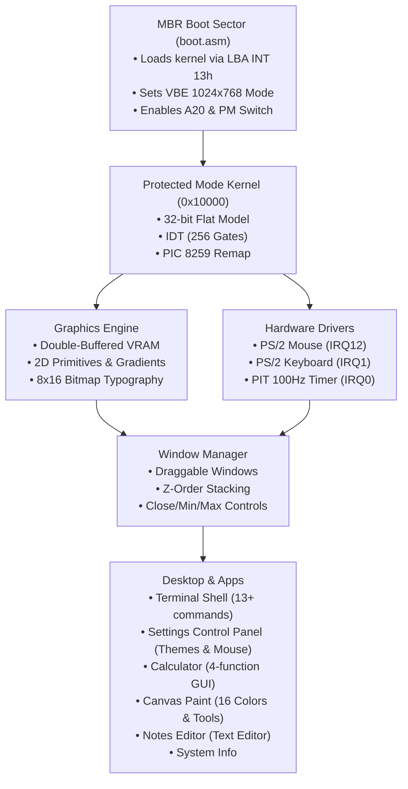

# ✦ AuraOS - Modern x86 Graphical Operating System

A custom 32-bit graphical operating system built from scratch, featuring a high-resolution linear framebuffer desktop, floating window manager, hardware interrupt-driven mouse and keyboard drivers, and interactive built-in applications.

---

## 📸 Preview


---

## 🚀 Quick Start & Emulators

### 1. Running in QEMU
Double-click `run.bat` in this folder, or run in PowerShell:
```powershell
.\run.ps1
```
Or manually:
```powershell
& "C:\Program Files\qemu\qemu-system-x86_64.exe" -drive format=raw,file=auraos.img -m 256M -vga std
```

### 2. Running in VMware (Workstation / Player / Fusion)
You can boot AuraOS in VMware using either the **Bootable CD-ROM ISO** or the **Virtual Disk (VMDK)**:

#### Method A: Using Bootable CD-ROM ISO (`auraos.iso`)
1. Open VMware and click **Create a New Virtual Machine**.
2. Select **Typical (recommended)** -> Next.
3. Select **Installer disc image file (iso)** and browse to:
   ```
   auraos.iso
   ```
4. For Guest Operating System, choose **Other** -> Version: **Other** (In VMware, **Other** is the standard 32-bit x86 option, while **Other 64-bit** is also supported).
5. Name your virtual machine (e.g. `AuraOS`) and allocate at least **128 MB RAM**.
6. Power on the virtual machine. AuraOS will boot directly from the CD into the desktop!

#### Method B: Using Virtual Disk (`auraos.vmdk`)
1. Create a new virtual machine -> Select **I will install the operating system later**.
2. Guest OS: **Other** -> Version: **Other** (32-bit).
3. When prompted for Disk, select **Use an existing virtual disk** -> Browse to `auraos.vmdk`.
4. Power on the VM.

### 3. Running in VirtualBox
1. Click **New** -> Name: `AuraOS` -> Type: `Other` -> Version: `Other/Unknown (32-bit)`.
2. RAM: `256 MB` -> Storage: Choose `auraos.iso` as Optical Disk or `auraos.img` as Hard Disk.
3. Start the virtual machine.

---

## 🛠️ Building from Scratch

Prerequisites available on your machine:
- **NASM** (for assembling the MBR bootloader and interrupt stubs)
- **Clang / LLVM** (targeting `i686-none-elf` freestanding)
- **LLD Linker** (`ld.lld`)
- **Python 3** (for the automated build orchestrator)

To recompile:
```powershell
python build.py
```
Or double-click `build.bat`.

---

## 🏛️ System Architecture



### 1. Bootloader (`boot/boot.asm`)
- **Size**: Exactly 512 bytes (fits in MBR sector 0).
- **Disk I/O**: Reads 128 sectors (64 KB) of kernel image into RAM at `0x10000` using BIOS INT 0x13 Extension (LBA Packet).
- **Display Setup**: Dynamically queries VBE 2.0+ controller info (`AX=4F00h`) and scans available video modes for Linear Frame Buffer TrueColor modes (1024x768 32-bit / 24-bit with fallbacks for VMware SVGA, VirtualBox, and QEMU).
- **Hardware Transition**: Enables Fast A20 gate, sets up Global Descriptor Table (GDT), enables protected mode (CR0 PE bit), sets stack to safe `0x1FFFF0` (1MB stack space), and executes far jump to 32-bit kernel.

### 2. Kernel Core & Drivers (`kernel/arch/`)
- **IDT (Interrupt Descriptor Table)**: 256 gates with CPU exception handlers (0..31) and hardware IRQs (32..47).
- **8259 PIC**: Remaps Master PIC to INT 0x20-0x27 and Slave PIC to INT 0x28-0x2F.
- **8254 PIT Timer**: Configured to 100 Hz (10ms resolution). Provides live uptime counter and sub-second timing.
- **CMOS Real-Time Clock (RTC)**: Interrogates hardware CMOS registers via I/O ports 0x70/0x71, decodes BCD/binary time and date, and provides live synchronization with host hardware.
- **ATA PIO Hard Disk Controller**: Low-level hard disk driver operating on Primary ATA bus ports (`0x1F0`–`0x1F7`, `0x3F6`). Implements 28-bit LBA mode sector reading, writing, and cache flushing (`0xE7`), providing real disk persistence for `auraos.img` and VMware `auraos.vmdk`.
- **PS/2 Keyboard**: Decodes scancodes, tracks modifier keys (Shift, Caps Lock), and buffers keystrokes for GUI apps.
- **PS/2 Mouse**: Configured to 200 Hz sample rate and 8 counts/mm resolution on IRQ12 with adaptive acceleration and selectable sensitivity (1.0x, 1.5x, 2.0x).

### 3. Graphics & Window Manager (`kernel/gfx/`, `kernel/wm/`)
- **Double Buffering**: 3.2 MB backbuffer in physical RAM at `0x200000` accelerated with x86 32-bit dword block transfers (`rep movsl` and `rep stosl`). Guarantees 100% flicker-free 60+ FPS rendering.
- **2D Primitives**: Anti-aliased circles, gradient fills, drop shadows, clipping rectangles, and crisp 8x16 typography.
- **Taskbar & Shell**: Live CMOS system date and time widget (`YYYY-MM-DD HH:MM:SS`) prominently positioned on the right of the taskbar next to the system tray, dynamic multi-window tabs starting on the left, and Start menu.
- **Window Management**:
  - Overlapping floating windows with z-order focus.
  - Smooth mouse title bar grabbing & dragging.
  - Full client drag and release callbacks (`on_drag`, `on_release`) for interactive apps.
  - Window control buttons: Close (red), Minimize (yellow), Maximize/Restore (green).
  - Active window header accent highlighting.

### 4. Interactive Applications (`kernel/apps/`)
- 📁 **File Explorer**: User-friendly storage manager featuring a modern dark-glass interface with breadcrumb location bar, top action toolbar (`Open in Editor`, `+ New`, `Delete`, `Refresh`), interactive "Store New File on Disk" dialog modal asking where to store files (`Documents`, `Storage`, or `System`), sidebar category filters with live badge counts, drive usage progress bar, color-coded file badges (`[TXT]`, `[CFG]`, `[SYS]`, `[SH]`, `[LOG]`), live monospace code preview card, double-click to open, and keyboard navigation (W/S, Enter, D, N).
- ⚙️ **Settings Control Panel**: Multi-tab control center with live desktop wallpaper theme switching, Date & Time adjustments (hours, minutes, days, months, years) with bidirectional CMOS hardware synchronization and saving, mouse sensitivity toggle, hardware VESA framebuffer readouts, and system statistics.
- 🎨 **Canvas Paint**: Advanced creative drawing studio featuring a dedicated 6MB extended memory buffer, 16-color palette (2 rows), 4 brush sizes (1px Pencil, 3px Brush, 6px Marker, Eraser), smooth Bresenham continuous stroke interpolation, Clear button, color preview, and real-time status bar.
- 📝 **Notes Editor**: Multiline document editor with top action toolbar (`+ New`, `Open File`, `Save`, `Save As`), interactive "Save File to Disk" dialog modal asking where to store files on disk (`Documents`, `Storage`, `System`) and filename input, active file indicator badge (`[ok]` / `* (Mod)`), interactive in-window Open File picker dialog, direct ATA hard disk sector persistence, gutter line numbering, and seamless inter-app opening from File Explorer and Terminal (`edit <file>`).
- 💻 **Terminal**: Interactive shell with command prompt (`aura@kernel:~$ `). Supports `files`, `edit <f>`, `ls`/`dir`, `cat`, `touch`, `rm`, `help`, `settings`, `paint`, `notes`, `calc`, `sysinfo`, `date`/`time`, `sync`, `theme`, `mem`, `ver`, `uptime`, `clear`/`cls`, `echo`, and `reboot`.
- 🧮 **Calculator**: Functional 16-button clickable desktop calculator supporting addition, subtraction, multiplication, and division.
- ℹ️ **System Info**: Displays OS architecture, display specs, live memory allocation, uptime, and animated CPU activity bar.

---

## 📂 Source Code Structure

```
AuraOS/
├── boot/
│   └── boot.asm            # 512-byte MBR bootloader with VBE & LBA read
├── kernel/
│   ├── arch/
│   │   ├── io.h            # In/Out port assembly macros
│   │   ├── idt.h / idt.c   # 256-entry Interrupt Descriptor Table
│   │   ├── pic.h / pic.c   # 8259 PIC initialization & EOI
│   │   ├── pit.h / pit.c   # 8254 Timer & Uptime counter
│   │   ├── rtc.h / rtc.c   # CMOS Real-Time Clock & Date driver
│   │   ├── ata.h / ata.c   # ATA PIO Hard Disk driver & Sector I/O
│   │   ├── kbd.h / kbd.c   # PS/2 Keyboard scancode decoder
│   │   └── mouse.h / mouse.c # PS/2 Mouse packet decoder & coordinates
│   ├── fs/
│   │   └── vfs.h / vfs.c   # Virtual File System & storage manager
│   ├── gfx/
│   │   ├── font.h / font.c # 8x16 crisp bitmap font
│   │   └── gfx.h / gfx.c   # Double-buffered graphics engine
│   ├── wm/
│   │   └── wm.h / wm.c     # Floating Window Manager & controls
│   ├── apps/
│   │   ├── apps.h
│   │   ├── app_files.c     # File Explorer GUI application
│   │   ├── app_term.c      # Interactive Terminal application
│   │   ├── app_calc.c      # Calculator application
│   │   ├── app_paint.c     # Canvas Paint application
│   │   ├── app_notes.c     # Multiline Notes text editor
│   │   ├── app_settings.c  # Settings Control Panel
│   │   └── app_sysinfo.c   # System Information dashboard
│   ├── libc/
│   │   └── string.h / string.c # Freestanding string & formatting library
│   ├── k_entry.asm         # 32-bit kernel entry & ISR/IRQ assembly stubs
│   ├── kernel.h
│   └── kernel.c            # Desktop shell, taskbar, start menu & event loop
├── linker.ld               # Linker script targeting 0x10000
├── build.py                # Master Python build orchestrator
├── make_iso.py             # Bootable CD-ROM ISO generator
├── build.bat               # Windows double-click build script
├── run.bat                 # Windows double-click QEMU launcher
├── run.ps1                 # PowerShell QEMU launcher
├── README.md               # Documentation & technical specs
├── auraos.img              # Bootable raw disk image (10 MB)
├── auraos.iso              # Bootable CD-ROM ISO for VMware / VirtualBox / QEMU
└── auraos.vmdk             # VMware Virtual Disk descriptor
```
